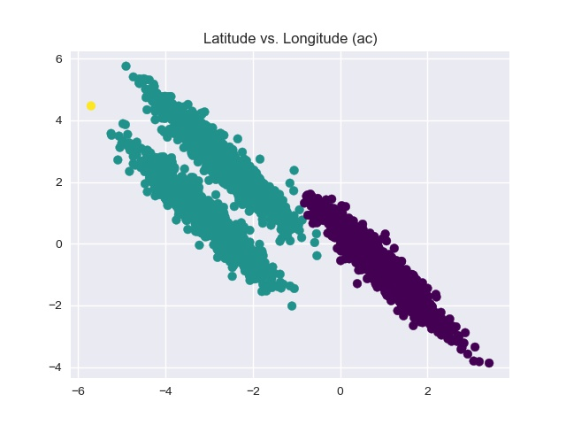
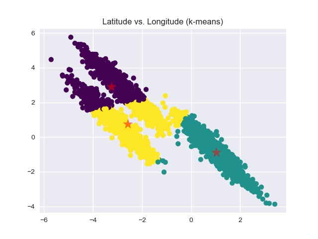
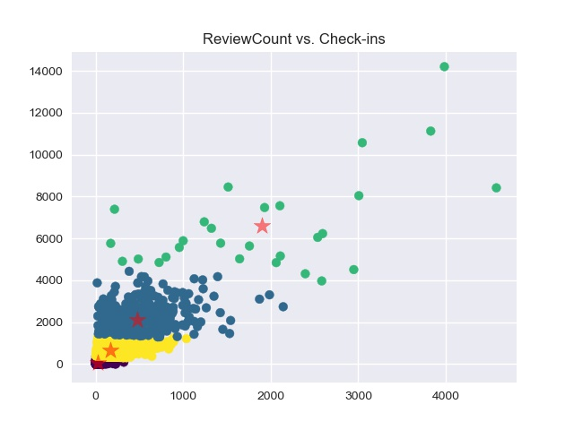
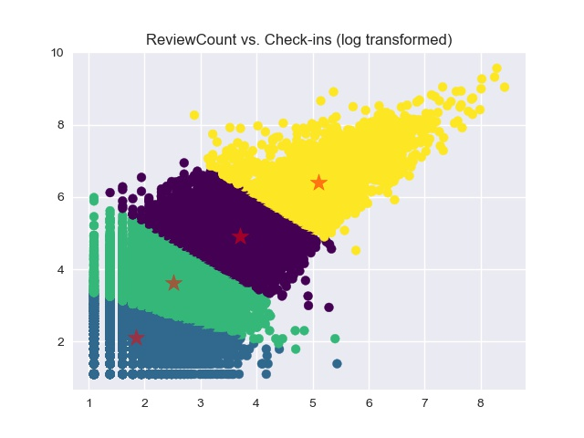

# **Clustering Algorithm in Machine Learning**
Implement the K-means and Agglemerative Clustering Algorithms.
## **Clustering on yelp.csv dataset**
Usage: python clustering.py :=some=path=file name:csv K ac

